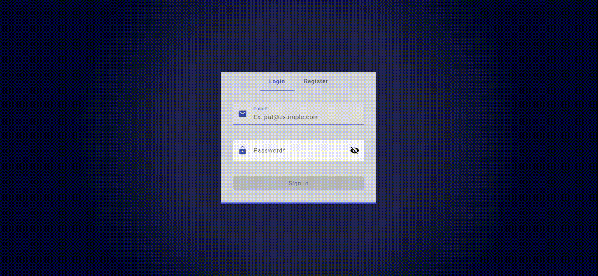
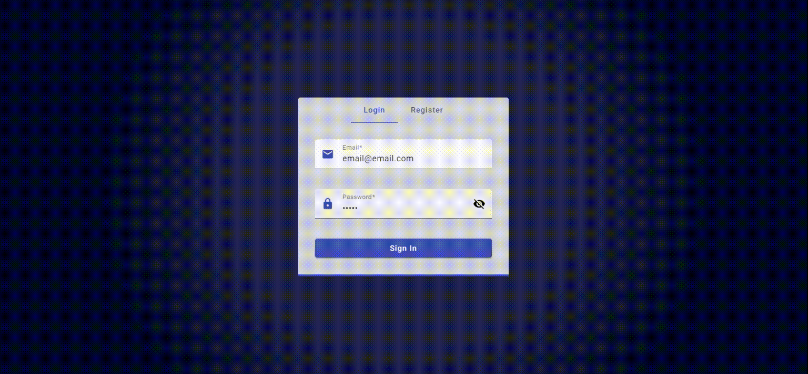
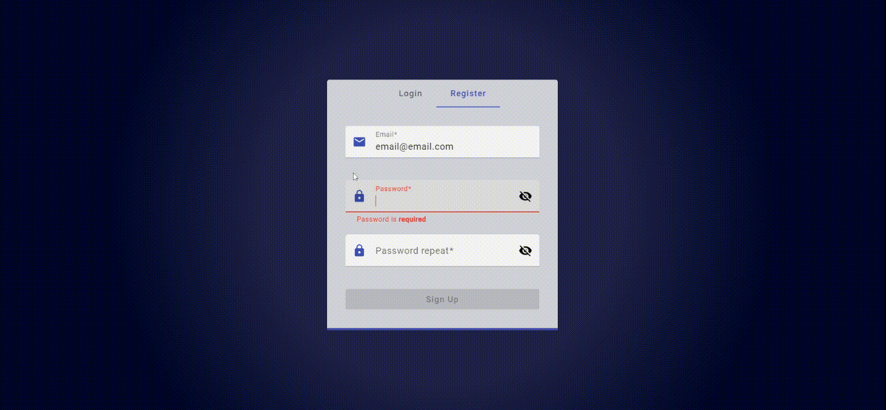

# AngularAuthentication

 &nbsp;&nbsp;&nbsp;&nbsp;
 &nbsp;&nbsp;&nbsp;&nbsp;
 &nbsp;&nbsp;&nbsp;&nbsp;

(Angular + AngularMaterial + RxJS)   

This repository contains a simple reusable login component for implementing both **sign-in** and **sign-up** functionality in an Angular application. 

## Overview

## SignIn (Success)

## SignIn (Failure)

## SignUp

## Structure

- *service* **AuthService** (providedIn: 'root')

- *module* **MaterialModule**

- *module* **AppModule**
    - *c:* AppComponent
        - *c:* HelloComponent
    - *m:* MaterialModule

- *module* **LoginModule**
    - *c:* LoginComponent   
        - *c:* SignInComponent  
        - *c:* SignUpComponent  
        - *c:* StatusComponent
    - *m:* MaterialModule

## Features
- Angular
- Angular Material
- Angular Material ErrorStateMatcher
- Reactive Forms
- Form Validators (built-in + custom)
- ChangeDetectionStrategy.OnPush for all components
- RxJS
- Login States
    - Mode = {'signin', 'signup'}
    - Status = {'initial', 'pending', 'success', 'error'}
 - Toggle Password Visibility
-  Lazy Loading (lazy-loaded route)

## Getting Started
### Prerequisite 
- Node.js
- Angular CLI
### Installation
- Clone the repository
<pre><code> $ git clone https://github.com/stefanoandroni/angular-authentication  </code></pre>
- Install the project dependencies
<pre><code> $ npm install </code></pre>
- Start the development server
<pre><code> $ ng serve </code></pre>
- Open your browser and navigate to http://localhost:4200/

## Usage
1. Import the LoginModule into your Angular application module (e.g., app.module.ts)
2. In your component template, use the **\<app-login>** selector to include the login component
3. Implement authentication methods in AuthService and customize the component

 ## TODO
 - states managment with NgRx